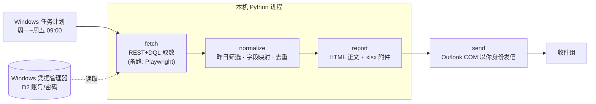

# D2_pipeline 开发文档

> 面向开发的工程文档。系统识别与「为什么选 REST」的完整论证见 [README.md](README.md)，这里不重复，
> 只讲**可行性判断、架构、模块契约、风险对策、里程碑**。
>
> 文中 `HOST` / `REPO` / `ACCOUNT` 为占位符（内网主机 / 仓库 / 账号）；真实值只在本地 `config.ini`（已 gitignore），模板见 [config.example.ini](config.example.ini)。

---

## 0. 一句话目标

每个工作日 09:00，在**你本机**自动从 Documentum D2 拉取「昨天收到」的全部任务条目，
生成一封邮件（分组统计 + 逐条 `I-xxxx-xxxxx` 说明 + Excel 明细附件），
用 Outlook 以你本人身份发给指定收件组。全程零人工、不依赖任何客户端开着。

---

## 1. 可行性结论（先看这个）

**总体：可行，且主路已实测确认。** 路线（Documentum REST + DQL，本机取数，Outlook 发信，
任务计划定时）选择正确，是这类内网 Documentum 系统里最干净、最合规的一条路。

> ### ✅ 无凭据侦察已确认（2026-08-20，`probe_recon.py`）
> | 项 | 实测值 |
> |---|---|
> | 本机 → `HOST` 连通性 | 可达（443/80/8080 端口开放） |
> | REST base | **`https://HOST/D2-REST`**（Documentum **D2 REST Services 20.4.0000.0240**） |
> | repository（docbase） | **`REPO`**（docbase 名，真实值见 config.ini） |
> | 服务端声明的认证方式 | **`auth_mode: basic`** —— Basic Auth 直连，**没有 SSO 墙** |
> | 通用 dctm-rest / cmis | 未部署（404），无关紧要，D2-REST 已覆盖 |
>
> **这意味着原先最大的两个风险（R1 REST 未部署、R2 SSO 拦截 Basic Auth）已排除。**

**唯一剩下的未知数**都在你的登录背后，只能由你亲自跑一次带凭据的只读探测确认：

> 你的账号能否登入 REST（预期能）、能否跑 **DQL**、以及 `Identifier / Sending / Receiving`
> 这几列到底对应哪个属性。→ 由 `probe_api.py` 一次性回答（见 §10）。

| 探测结果 | 走哪条路 | 说明 |
|---|---|---|
| ✅ REST 活着 + Basic Auth（**已确认**） + DQL 可用 | **主路（REST+DQL）** | 干净、快、稳，全程官方 API |
| REST 活着但 DQL 被禁 / 只开对象导航 | 主路降级 | 改用对象/文件夹资源遍历，代码稍复杂 |
| ~~REST 未部署 / 被 SSO 挡~~ | ~~备路~~ | **已排除**——备路 `probe_d2.py` 仅作保险，预计用不到 |

**可行性评分（主路）：高（已从"待验证"升级为"环境已确认"）。** 风险集中在「取数」这一环，
且大半已消除；发信与定时环节成立。

### 动手前必须知道的三个坑（详见 §6）

1. **SSO 可能拦截 Basic Auth** —— 内网 D2 前面常挂 SAML/Kerberos 反代，REST 端点可能把 Basic Auth 重定向到登录页。探测时看返回 `401`（好，说明能直连认证）还是 `302 → 登录页`（坏，被 SSO 接管）。
2. **Outlook COM 在「未登录会话」下无法被计划任务驱动** —— 这是最常见的翻车点。Outlook 自动化需要交互式桌面；任务计划若设「不管用户是否登录都运行」，会落到 session 0，驱动不了 Outlook。对策见 §6/§9。
3. **「昨天收到」的口径有陷阱** —— 当前 inbox 是**快照**：昨天收到、但今早 09:00 前你已处理/转走的条目，不在 inbox 里，会漏统计。v1 先接受此局限；要精确需改读审计轨迹，见 §5。

---

## 2. 架构总览



**为什么每一环都在本机：** `HOST` 是 ITU 内网地址，云端沙箱无内网访问权。取数、发信都必须在你本机进程内完成，凭据也只留在本机。

---

## 3. 模块划分与契约

按仓库名 `D2_pipeline` 的语义拆成清晰的流水线阶段，每段单独可测：

| 模块 | 拟建文件 | 输入 | 输出 | 关键依赖 |
|---|---|---|---|---|
| 配置/凭据 | `config.py` | 凭据管理器 / `config.ini` | `Settings` 对象 | `keyring` |
| 取数（主路） | `fetch_rest.py` | 日期范围、账号 | `list[RawItem]` | `requests` |
| 取数（备路） | `fetch_browser.py` | 同上 | `list[RawItem]` | `playwright` |
| 归一化 | `normalize.py` | `list[RawItem]` | `list[Item]`（统一字段） | — |
| 报告 | `report.py` | `list[Item]` | `(html: str, xlsx_path)` | `openpyxl` |
| 发信 | `send_outlook.py` | html、附件、收件组 | 草稿 / 已发 | `pywin32` |
| 编排 | `main.py` | 无（读配置） | 退出码 + 日志 | 上面全部 |

**契约要点：** 主路/备路两个 fetch 模块**返回同一种 `RawItem`**，下游（normalize/report/send）对取数方式无感知——这样探测结果无论主备，下游代码都不用改。

---

## 4. 数据来源与字段映射

取数走 DQL over D2-REST（端点已确认）：

```
GET https://HOST/D2-REST/repositories/REPO?dql=<DQL>&items-per-page=200&page=1
Authorization: Basic base64(用户名:密码)
Accept: application/json
```

任务列表 = Documentum 的 workflow inbox，对象类型 **`dmi_queue_item`**：

```sql
select * from dmi_queue_item
where name = '<你的 user_name>' and delete_flag = false
order by date_sent desc
```

界面列 → 属性（大部分能直接对上）：

| 界面列 | 属性 | 备注 |
|---|---|---|
| Sent | `date_sent` | **UTC** 存储；「昨天收到」按本地(日内瓦)时区算边界再换算 UTC |
| Sender | `sent_by` / `supervisor_name` | 均为 ITU 员工登录名 |
| Priority | `priority` | |
| 状态 | `task_state` | `dormant`(刚到) / `acquired`(已接手) |
| Subject | `task_subject` | 富文本，见下方解析 |

**字段映射已定稿（M0 探测）**：`Identifier / 文书类型 / 国家 / 类别码` 全部**编码在 `task_subject` 里**，
无需再走关联对象。`task_subject` 结构（真实样本，token 间混用不间断空格 `\xa0`，已归一化）：

```
I-2099-000001  Handle incoming E-COMM  1/2/2099, 7:47:57 AM   09A ADVANCE PUBLICATION, 09C SPACE SYSTEM COORDINATION  ZZZ (CSS)
└ identifier ┘ └── action / 文书类型 ─┘ └── 本地时间 ──┘       └──────────── categories(逗号分隔) ────────────┘        └国家┘└单元┘
（以上为合成示例，格式与真实一致，不含真实业务数据）
```

`src/normalize.py:parse_subject()` 负责解析，已用 13 个真实样本 + 合成单测验证（12/13，空 subject 除外）。
> 兜底：极少数刚到达的 `dormant` 任务 `task_subject` 短暂为空（几分钟后即填充）；`parsed_ok=False` 标记，
> 需要时可用 `probe_api2.py` 验证过的链路 `workflow→dmi_package.r_component_id→业务文档` 取回。

---

## 5. 「昨天」的口径（需你拍板）

- **基本定义**：`date_sent` 落在 `[昨天 00:00, 今天 00:00)`。
- **周一特例**：是否覆盖整个周末（周六、周日 + 周五）？建议**周一覆盖周五~周日三天**。
- **快照局限（重要）**：当前 inbox 只含**尚未处理**的条目。昨天收到、今早发信前已被你处理/转走的条目，**不在 inbox**，会漏。
  - v1：接受此局限（多数「日报」场景够用）。
  - 若必须精确统计「昨天到达的全部条目（含已处理）」：改读**审计轨迹** `dm_audittrail`（按 `time_stamp` + 事件类型过滤），或 `dmi_workitem` 历史。成本更高，列为 v2 可选。

---

## 6. 风险与对策

| # | 风险 | 影响 | 对策 |
|---|---|---|---|
| ~~R1~~ | ~~REST 组件未部署~~ | — | ✅ **已排除**：`D2-REST 20.4` 确认在线 |
| ~~R2~~ | ~~SSO 拦截 Basic Auth~~ | — | ✅ **已排除**：服务端 `auth_mode=basic` |
| R3 | **DQL 被禁用/账号无权限** | 只能对象导航 | 由 `probe_api.py` 步骤 2 验证；若禁用改用 REST 对象/文件夹资源遍历 inbox |
| R4 | **Outlook COM 在非交互会话跑不起来** | 到点不发信 | ①任务计划设「仅在用户登录时运行」；②或改 **ITU 内部 SMTP**（`smtplib`）；③或 **Graph** 发信。首选①，最省心选② |
| R5 | **Outlook 编程发信安全弹窗** | 卡住/需点确认 | 首轮**只存草稿**（`.Save()` 不 `.Send()`）人工核对；量产阶段由策略/Redemption 抑制弹窗 |
| R6 | **inbox 快照漏已处理条目** | 统计偏少 | 见 §5，v1 接受 / v2 用审计轨迹 |
| R7 | **备路 UI 抓取脆弱** | D2 改版即失效 | 仅当 R1/R2 触发才用；把选择器集中、加断言与失败告警 |
| R8 | **凭据/业务数据泄露** | 合规事故 | `keyring` 存密码不落盘；`probe_out/`、`output/`、`config.ini` 已在 `.gitignore`；**`storage_state.json` 含会话 Cookie，绝不入库** |
| R9 | **自签证书** | 请求报错 | 内网自签，`verify=False` 已处理（生产可换成固定 CA bundle） |

---

## 7. 里程碑与任务清单

| 阶段 | 交付 | 出口标准 |
|---|---|---|
| M0a 无凭据侦察 | ✅ `probe_recon.py` | ✅ **已完成**：主路确认（D2-REST/REPO/basic） |
| M0b 带凭据探测 | ✅ `probe_api.py` | ✅ **已完成**：DQL 可用、账号 ACCOUNT、inbox 400 条 |
| M0c 数据模型 | ✅ `probe_api2.py` | ✅ **已完成**：字段映射定稿（task_subject 解析） |
| M1 取数 | ✅ `fetch_rest.py` + `normalize.py` + `main.py` | ✅ **已完成**：单测 7/7，条数与界面对上 |
| M2 报告 | ✅ `report.py` + `xlsx_min.py`（纯标准库 xlsx）+ `config.py` | ✅ **已完成**：English HTML + xlsx，离线用真实样本校验通过 |
| M3 发信（草稿） | ✅ `send_outlook.py`（pywin32 草稿 + 标准库 .eml 兜底） | ✅ **代码完成**：.eml 路离线校验通过；Outlook 路待你装 pywin32 后试 |
| **M4 定时**（← 当前） | 注册 Windows 任务计划 + 凭据入 keyring | 到点自动生成草稿；连续两个工作日稳定 |
| M5 验收 | 切换为真正发送 + 对账 | 收件组收到、条数与 D2 界面一致 |

---

## 8. 目录结构（建议）

```
D2_pipeline/
├─ README.md              # 背景与路线论证
├─ DEVELOPMENT.md         # 本文件
├─ requirements.txt       # M1+ 依赖（M0/M2 纯标准库）
├─ setup.bat              # 备路才需要（装 Playwright）
├─ .gitignore             # 护住凭据/业务数据
├─ config.example.ini     # 配置模板（入库）
├─ config.ini             # 真实配置：收件人等（本地，gitignore）
├─ probe_recon.py         # M0a 无凭据侦察
├─ probe_api.py           # M0b 带凭据探测
├─ probe_api2.py          # M0c 业务对象链探测
├─ probe_d2.py            # 备路浏览器探测（预计用不到）
├─ src/
│  ├─ config.py           # 配置加载
│  ├─ fetch_rest.py       # ✅ 只读 DQL 客户端 + 取 inbox
│  ├─ normalize.py        # ✅ task_subject 解析 + Item + 昨日边界
│  ├─ report.py           # ✅ HTML 正文 + xlsx 明细
│  ├─ xlsx_min.py         # ✅ 纯标准库 xlsx 写入器
│  ├─ send_outlook.py     # ✅ Outlook 草稿(pywin32) + .eml 兜底；绝不自动发送
│  └─ main.py             # ✅ 入口：取昨日→归一化→汇总→出报告
├─ tests/
│  └─ test_normalize.py   # ✅ 解析/时区/边界单测 7/7
└─ (probe_out/  output/   # 运行时生成，不入库)
```

---

## 9. 配置与凭据

- **密码存储**：优先 **Windows 凭据管理器**（Python `keyring`，`keyring.set_password("D2","<user>","<pwd>")`），
  代码用 `keyring.get_password` 读取。**不写进 `config.ini`、不进代码、不进对话。**
- **非敏感配置**（收件组、语言、"昨天"口径）：放 `config.ini`，可入库一份 `config.example.ini` 模板。
- **红线**：`probe_out/`、`output/`、真实 `config.ini`、`storage_state.json` **一律不入库**（`.gitignore` 已覆盖）。
  仓库若为 public，`storage_state.json` 里的会话 Cookie 一旦泄露 = 你的 D2 身份被盗用。
- **任务计划**：周一~周五 09:00；若用 Outlook COM 发信，设「仅在用户登录时运行」（见 R4）。

---

## 10. 下一步（现在就做）

1. **跑带凭据探测**（M0b，全程只读 GET，无需 venv/pip —— 纯标准库）：
   ```powershell
   cd D:\codingSpace\D2_agent
   python probe_api.py
   ```
   脚本会提示输入 D2 登录名和密码（`getpass` 当场读入，不落盘、不外传）。
   跑完产出 `probe_out\api_01..06.json`（含业务数据、无密码，已被 `.gitignore` 挡住）。
   > 无凭据侦察（M0a）已由 `probe_recon.py` 完成，主路确认在线，无需再跑。备路 `probe_d2.py` 预计用不到。

2. **给我 4 个确认项**（M2 前给即可）：
   - ① 收件组邮箱/通讯组地址
   - ② 「昨天」在周一是否覆盖整个周末
   - ③ 「内容概述」深度：只用任务属性（快）/ 读附件正文 PDF·Word（慢）
   - ④ 正文语言：中 / 英 / 双语

3. 把 `probe_out/api_*.json` 留在文件夹里告我一声，我据此定稿字段映射并写 M1 取数模块。
